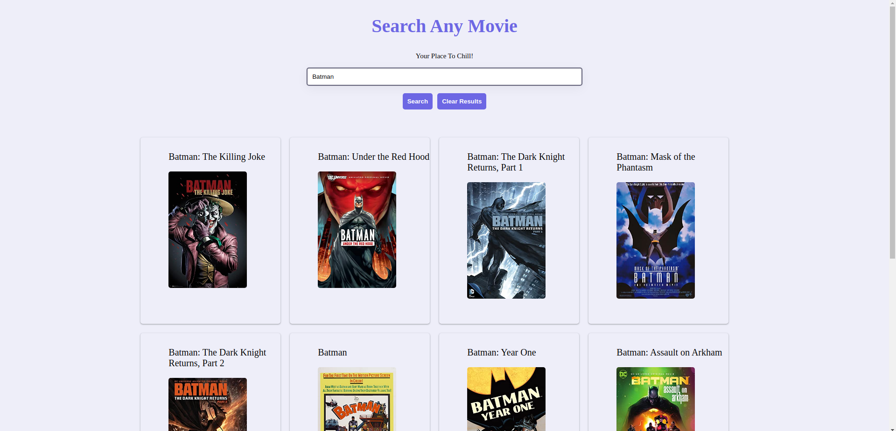
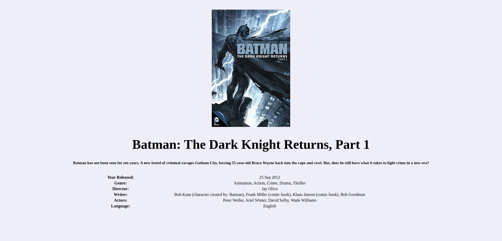

# MovieHub

---

#### It is web application where people can search any movie and they can see movies details such as Director name,Genre.

---

## Technology

> [React](https://reactjs.org/docs/getting-started.html "React documentaion")  
> [CSS](https://developer.mozilla.org/en-US/docs/Web/CSS "CSS documentaion")  
> [API](https://stoplight.io/api-documentation-guide)

# Snapshots

> 

> 

# Running the project

- Clone the repository to your local system.`https://github.com/anuprajvarma/moviehub.git`
- Go to [OMDB API](https://www.omdbapi.com/) find API KEY and use our Application
- Use this API KEY  
  `https://www.omdbapi.com/?s=${searcht}&page=2&apikey=API KEY HERE`  
  `https://www.omdbapi.com/?i=${id}&apikey=API KEY HERE`
- In the root folder and enter the following command in the CLI

```
     npm i or yarn
     npm start or yarn start
```
